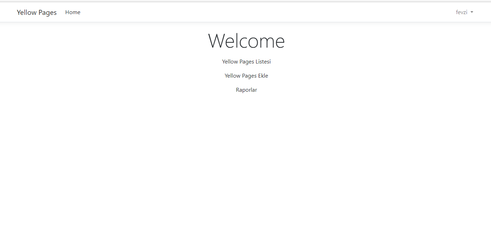
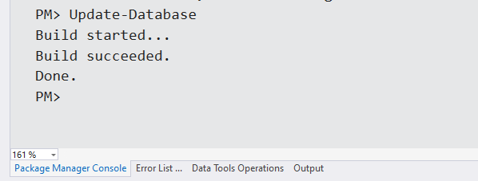
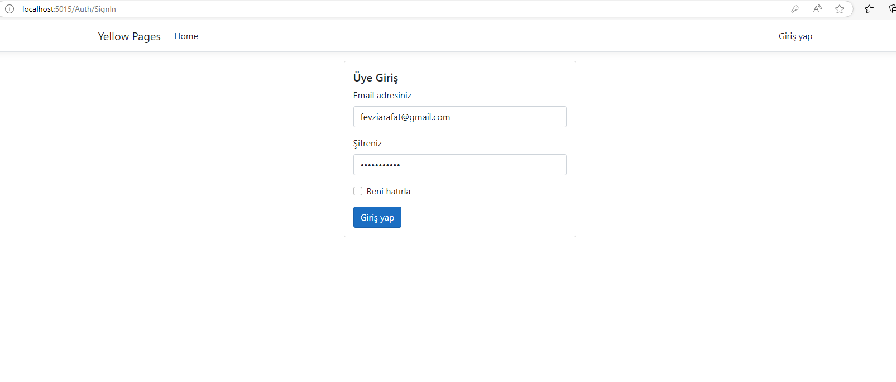

# Proje Hakkında

- Kullanıcı rehberde kişi oluşturabilir
- Kullanıcı rehberden kişi kaldırabilir
- Kullanıcı rehberdeki kişiye iletişim bilgisi ekleyebilir
- Kullanıcı rehberdeki kişiye iletişim bilgisi kaldırabilir
- Kullanıcı rehberdeki  kişileri listeleyebilir
- Kullanıcı rehberdeki  bir kişiyle ilgili iletişim bilgilerinin de yer aldığı detay bilgilerini
getirebilir

- Kullanıcı rehberdeki kişilerin bulundukları konuma göre istatistiklerini çıkartan bir rapor alabilir
- Kullanıcı sistemin oluşturduğu raporları listeleyebilir
- Kullanıcı sistemin oluşturduğu bir raporun detay bilgilerinin görebilir

# Kurulum

Projede Docker sistemi kullanıldığı için bilgisayarınızda Docker ın yüklü olması gerekmektedir.

Docker kurulumu için [https://www.docker.com/ ](https://www.docker.com/) sayfasını ziyaret edebilirsiniz
Docker ı kurduktan sonra bilgisayarınızda olması gereken Containerlar ve kurulum için gereklı komutları aşağıdadır

### MongoDb

`docker container run --name YellowPagesDb --publish 27017:27017 -d mongo`

### RabbitMQ

`docker run -d --hostname my-rabbit --name docker-rabbit rabbitmq:3`

### IdentityServer4

`docker run -e "ACCEPT_EULA=Y" -e "MSSQL_SA_PASSWORD=Password123." --name "identityServer4" -p 1433:1433 -d mcr.microsoft.com/mssql/server:2019-latest`

IdentityServer4 projesi .Net Core 3.1 kullanmaktadır kurulum için

[https://dotnet.microsoft.com/en-us/download/dotnet/thank-you/runtime-aspnetcore-3.1.32-windows-x64-installer?cid=getdotnetcore](https://dotnet.microsoft.com/en-us/download/dotnet/thank-you/runtime-aspnetcore-3.1.32-windows-x64-installer?cid=getdotnetcore) 

[https://dotnet.microsoft.com/en-us/download/dotnet/thank-you/runtime-3.1.32-windows-x64-installer?cid=getdotnetcore ](https://dotnet.microsoft.com/en-us/download/dotnet/thank-you/runtime-3.1.32-windows-x64-installer?cid=getdotnetcore) 

linklerini kullanabilirsiniz.

kurulumlar tamamlandıktan sonra projede IdentityServer4 için database migration yapılması gerekmekte migration dosyası hazır olduğundan dolayı direk aşağıdaki gibi database update i yapılabilir.

migration tamamlandıktan sonra projeyi çalıştırıp giriş yap dedikten sonra gelen ekrandaki önceden tanımlı kullınıcı adı ve şifreyi değiştirmeden projeye giriş yapılabilir

ardından istenilen kullanıcı ve rapor işlemleri gelen ekranlardan kolaylıkla gerçekleştirilebilir.
